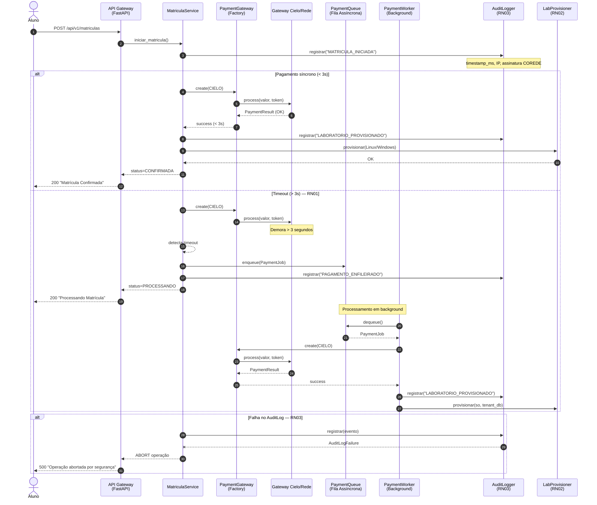
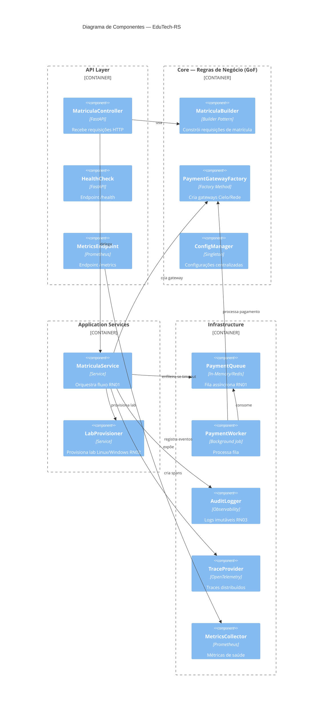
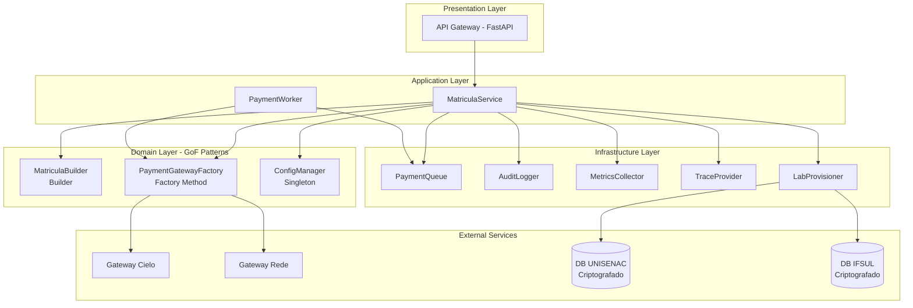
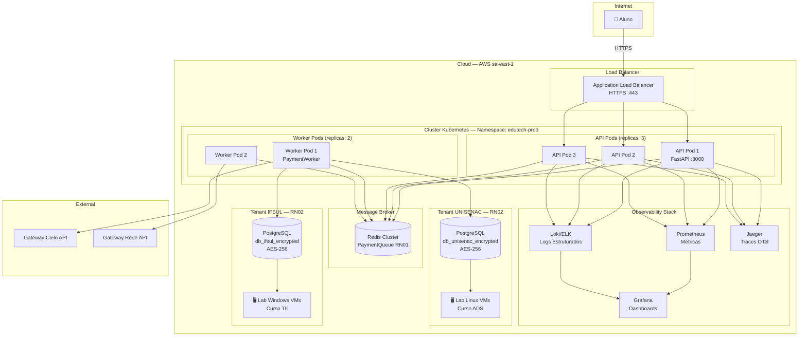
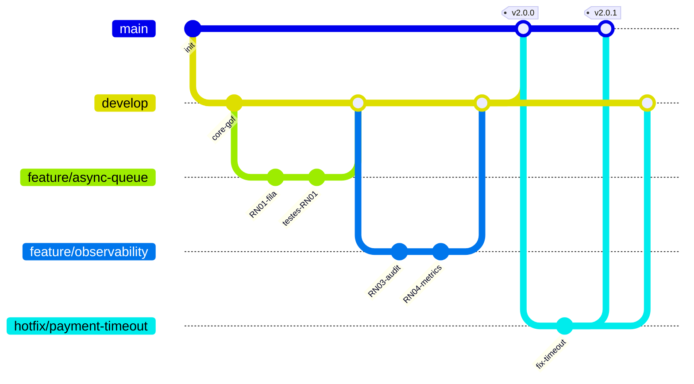
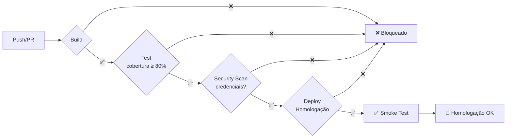
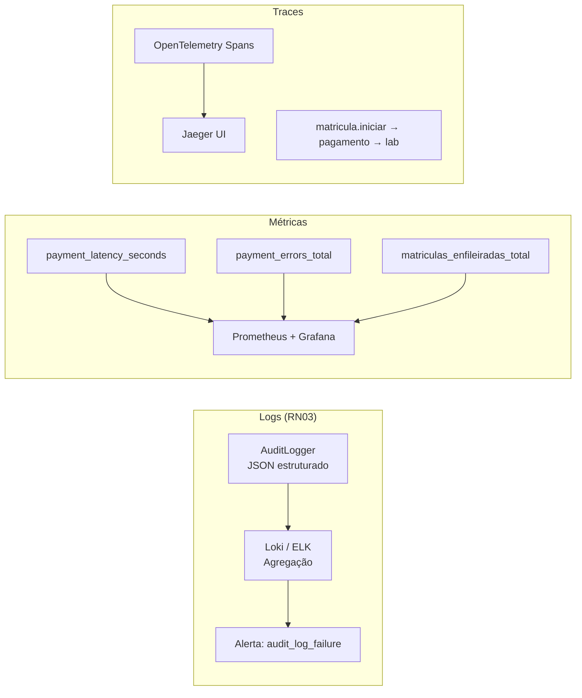

# Projeto Prático Integrado A — Infraestrutura Escalável da EduTech-RS

**Disciplina:** Engenharia de Software II  
**Professor:** Prof. Me. Fábio Giulian Marques  
**Aluno(a):** _[PREENCHA SEU NOME]_  
**Data:** Julho/2026

---

## Sumário

1. [Visão Geral](#1-visão-geral)
2. [Regras de Negócio e Rastreabilidade](#2-regras-de-negócio-e-rastreabilidade)
3. [Diagrama de Sequência — Matrícula e Pagamento](#3-diagrama-de-sequência--matrícula-e-pagamento)
4. [Diagrama de Componentes (C4)](#4-diagrama-de-componentes-c4)
5. [Diagrama de Implantação](#5-diagrama-de-implantação)
6. [Estratégia de Branching — GitFlow](#6-estratégia-de-branching--gitflow)
7. [Pipeline CI/CD](#7-pipeline-cicd)
8. [Observabilidade — Logs, Métricas e Traces](#8-observabilidade--logs-métricas-e-traces)
9. [Padrões GoF Integrados](#9-padrões-gof-integrados)
10. [Defesa Técnica — Roteiro para Banca](#10-defesa-técnica--roteiro-para-banca)

---

## 1. Visão Geral

A EduTech-RS evoluiu de um sistema monolítico (Projeto 1) para uma **arquitetura orientada a eventos** com processamento assíncrono, isolamento multi-tenant e observabilidade completa. O arquiteto decidiu **sacrificar a resposta síncrona imediata** (RN01) em favor da **resiliência e disponibilidade** — o aluno recebe status "Processando Matrícula" em vez de esperar o gateway de pagamento.

### Decisão Arquitetural Principal (AD-01)

> **Timeout de 3 segundos no gateway → enfileiramento assíncrono.**  
> Justificativa: gateways externos (Cielo/Rede) têm SLA variável. Bloquear o aluno por 10–30s degrada a experiência e aumenta timeout de conexão no load balancer. A fila garante que nenhuma matrícula seja perdida.

---

## 2. Regras de Negócio e Rastreabilidade

| RN | Regra | Componente | Arquivo | Pipeline CI/CD |
|----|-------|------------|---------|----------------|
| RN01 | Timeout 3s → fila assíncrona | `MatriculaService`, `PaymentQueue` | `src/workers/payment_worker.py` | Teste `test_timeout_enfileira_matricula` |
| RN02 | Isolamento UNISENAC (Linux) / IFSUL (Windows) | `MatriculaBuilder` | `src/core/matricula_builder.py` | Testes `test_build_unisenac_linux`, `test_build_ifsul_windows` |
| RN03 | Log de auditoria imutável com abort | `AuditLogger` | `src/observability/audit.py` | Teste `test_falha_log_aborta_operacao` |
| RN04 | Cobertura ≥ 80%, sem credenciais | Pipeline GitHub Actions | `.github/workflows/ci-cd.yml` | Jobs `test` + `security-scan` |

---

## 3. Diagrama de Sequência — Matrícula e Pagamento

Fluxo completo evidenciando **RN01** (timeout assíncrono) e **RN03** (auditoria).



---

## 4. Diagrama de Componentes (C4)

Visão de containers e componentes internos, mostrando desacoplamento entre regras de negócio e infraestrutura.



### Diagrama de Componentes UML (alternativo)



---

## 5. Diagrama de Implantação

Evidencia **RN02** — isolamento de infraestrutura por instituição.



### Isolamento RN02 — Detalhamento

| Instituição | Curso | SO do Laboratório | Banco de Dados | Criptografia |
|-------------|-------|-------------------|----------------|--------------|
| UNISENAC | ADS | Linux (Ubuntu 22.04) | `db_unisenac_encrypted` | AES-256 at-rest |
| IFSUL | TII | Windows Server 2022 | `db_ifsul_encrypted` | AES-256 at-rest |

Os dados de faturamento **nunca compartilham** a mesma instância de banco. O `MatriculaBuilder` resolve o tenant no momento da construção da requisição.

---

## 6. Estratégia de Branching — GitFlow

### Por que GitFlow (e não Trunk-based)?

| Critério | GitFlow ✅ | Trunk-based |
|----------|-----------|-------------|
| Equipe pequena (dupla) | Ideal — branches isoladas | Exige feature flags maduras |
| Releases versionadas | `release/*` com tag semântica | Deploy contínuo diário |
| Hotfix em produção | `hotfix/*` sem afetar develop | Possível, mas arriscado |
| Maturidade DevOps da startup | Em crescimento — GitFlow dá segurança | Requer cultura madura |

**Decisão:** GitFlow, pois a EduTech-RS está em fase de crescimento com releases quinzenais e necessidade de hotfixes sem derrubar homologação.

### Estrutura de Branches



| Branch | Propósito | Proteção |
|--------|-----------|----------|
| `main` | Produção estável | PR obrigatório + CI verde |
| `develop` | Integração contínua | PR obrigatório + CI verde |
| `feature/*` | Novas funcionalidades | CI ao push |
| `release/*` | Preparação de release | Testes + cobertura ≥ 80% |
| `hotfix/*` | Correções urgentes | CI + review |

---

## 7. Pipeline CI/CD

### Fluxo da Esteira (RN04)



### Etapas do Pipeline

| # | Etapa | O que faz | Gate RN04 |
|---|-------|-----------|-----------|
| 1 | **Build** | Instala deps, valida estrutura | Estrutura de pastas correta |
| 2 | **Test** | `pytest --cov-fail-under=80` | Cobertura ≥ 80% |
| 2b | **Security Scan** | Grep por credenciais expostas | Zero secrets no código |
| 3 | **Deploy** | Simula deploy + smoke test | Só em `main`/`develop` |

### Rastreabilidade Componente → Pipeline

O `MatriculaService` (componente do diagrama) é testado por `test_timeout_enfileira_matricula` no job **Test**. Se esse teste falhar, o deploy é **automaticamente bloqueado** — traduzindo RN04 em código.

Arquivo: `.github/workflows/ci-cd.yml`

---

## 8. Observabilidade — Logs, Métricas e Traces

### Os Três Pilares



### Cenário de Desastre — Defesa para Banca

**Pergunta do professor:** *"Se a API da Cielo começar a falhar intermitentemente com erros 500, como a observabilidade alerta Ops?"*

**Resposta estruturada:**

1. **Métricas (detecção em < 1 min):**
   - `edutech_payment_errors_total{gateway="cielo", error_type="HTTPError"}` incrementa
   - `edutech_payment_latency_seconds` bucket `> 3.0` dispara
   - Alerta Grafana: `rate(payment_errors_total[5m]) > 0.1` → PagerDuty/Slack

2. **Logs (diagnóstico):**
   - Cada erro gera log JSON: `{"evento": "PAGAMENTO_FALHA", "gateway": "cielo", "status_code": 500}`
   - Loki query: `{app="edutech-rs"} |= "PAGAMENTO_FALHA" | json`
   - RN01 entra em ação: matrículas vão para fila em vez de falhar

3. **Traces (root cause):**
   - Span `pagamento.sincrono` mostra latência de 4.2s no trace Jaeger
   - Correlation ID liga log → métrica → trace do mesmo aluno

4. **Ação automática:**
   - Circuit breaker no `PaymentGatewayFactory` troca para gateway Rede
   - Worker processa fila retroativamente quando Cielo normaliza

### Exemplo de Log de Auditoria (RN03)

```json
{
  "aluno_id": "ALU-001",
  "timestamp_ms": 1720636800123,
  "ip_origem": "189.45.12.88",
  "assinatura_digital": "COREDE-CENTRO-SUL-SECURE-2026",
  "evento": "LABORATORIO_PROVISIONADO",
  "detalhes": {
    "so": "Linux",
    "tenant_db": "db_unisenac_encrypted"
  }
}
```

### Métricas Expostas

| Métrica | Tipo | Alerta |
|---------|------|--------|
| `edutech_payment_latency_seconds` | Histogram | p95 > 3s |
| `edutech_payment_errors_total` | Counter | rate > 10% em 5min |
| `edutech_matriculas_enfileiradas_total` | Counter | informativo |
| `edutech_audit_log_failures_total` | Counter | > 0 → CRÍTICO |
| `edutech_payment_queue_size` | Gauge | > 100 → WARNING |

---

## 9. Padrões GoF Integrados

| Padrão | Classe | Responsabilidade | Onde na Arquitetura |
|--------|--------|------------------|---------------------|
| **Singleton** | `ConfigManager` | Configurações únicas (timeout, assinatura) | Usado por `MatriculaService` e `AuditLogger` |
| **Factory Method** | `PaymentGatewayFactory` | Cria `CieloGateway` ou `RedeGateway` | Chamado por `MatriculaService` e `PaymentWorker` |
| **Builder** | `MatriculaBuilder` | Constrói `MatriculaRequest` com isolamento RN02 | Chamado pelo `MatriculaController` (API) |

O acoplamento é **unidirecional**: API → Services → Core (GoF) → Infrastructure. Os padrões do Projeto 1 foram reutilizados sem modificação de interface.

---

## 10. Defesa Técnica — Roteiro para Banca

### Pergunta 1: Rastreabilidade Componente → Pipeline

> "Como o MatriculaService do diagrama se reflete no Build?"

O `MatriculaService` está em `src/workers/payment_worker.py`. O job **Test** da pipeline executa `pytest` que inclui `test_timeout_enfileira_matricula` — testando diretamente o RN01 desse componente. Se o componente quebrar, o deploy é bloqueado.

### Pergunta 2: Por que GitFlow?

A startup tem releases quinzenais, dupla de devs, e precisa de hotfix sem afetar develop. Trunk-based exigiria feature flags e deploy diário — over-engineering para o estágio atual.

### Pergunta 3: Cenário Cielo 500

Ver seção 8 — Métricas detectam, Logs diagnosticam, Traces localizam, RN01 protege o aluno com fila assíncrona.

### Pergunta 4: Por que sacrificar resposta síncrona? (RN01)

- **Disponibilidade > Consistência imediata** (teorema CAP)
- Aluno não fica com tela travada por 30s
- Nenhuma matrícula é perdida (fila persistente)
- Gateway externo é ponto de falha fora do nosso controle

---

## Repositório

**Link:** _[INSIRA O LINK DO SEU REPOSITÓRIO GITHUB AQUI]_

---

*Documento gerado para o Projeto Prático Integrado A — EduTech-RS. Uso de IA autorizado conforme diretriz da disciplina; decisões arquiteturais são de responsabilidade do aluno.*
